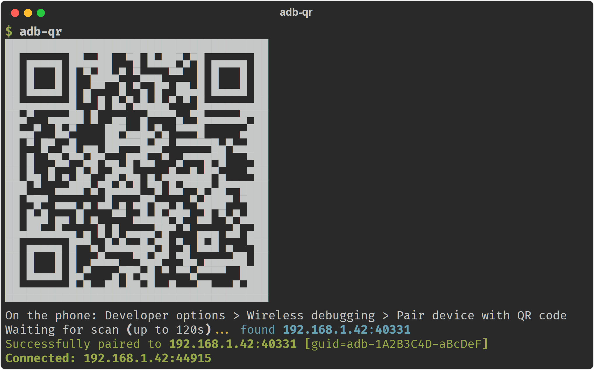

# adb-qr

Pair your Android phone for wireless debugging by scanning a QR code in your
terminal — like Android Studio's *"Pair device with QR code"*, but for the
CLI. No typing pairing codes, no looking up IPs and ports.



## Why another QR-pairing tool?

Existing tools ([adb-wireless](https://github.com/teamclouday/adb-wireless),
[adb-qr](https://github.com/oosawy/adb-qr), and friends) run their **own**
mDNS listener to discover the phone after it scans the QR. That works on a
native host — and silently fails inside **WSL2, containers, and VMs**, where
LAN multicast never reaches the virtualized network. The QR renders, the
phone scans it, and then... nothing.

`adb-qr` doesn't listen for mDNS at all. It asks the **adb server itself**
what it sees (`adb mdns services`), so discovery happens wherever the server
runs. On WSL2, point it at the Windows `adb.exe` (it does this automatically)
and the Windows side — which *can* see your LAN — does the discovery. The
same trick means zero networking dependencies on any platform: if `adb`
works, `adb-qr` works.

## Install

With [uv](https://docs.astral.sh/uv/) (recommended):

```sh
uv tool install git+https://github.com/aleixrodriala/adb-qr
```

With [pipx](https://pipx.pypa.io/):

```sh
pipx install git+https://github.com/aleixrodriala/adb-qr
```

Or run it once without installing anything:

```sh
uvx --from git+https://github.com/aleixrodriala/adb-qr adb-qr
```

### Requirements

- Android **platform-tools 31+** on the host that has network visibility
  (on WSL2: install them on **Windows**; `adb-qr` finds `adb.exe` by itself)
- A phone on **Android 11+**, on the same Wi-Fi as that host
- Python 3.10+ (handled for you by `uv`/`pipx`)

## Usage

```
adb-qr                # show QR, wait for scan, pair, connect
adb-qr --pair-only    # stop after pairing (adb usually auto-connects anyway)
adb-qr --timeout 300  # wait longer for the scan
adb-qr --no-invert    # flip QR colors if your phone won't scan it
adb-qr --adb /path/to/adb   # explicit adb binary (env var ADB works too)
```

On the phone: **Settings → Developer options → Wireless debugging →
Pair device with QR code**, and point the camera at your terminal.

## How it works

The QR encodes `WIFI:T:ADB;S:<name>;P:<password>;;` — the same payload
Android Studio generates. When the phone scans it:

1. The phone starts advertising an `_adb-tls-pairing._tcp` mDNS service
   whose instance name is the `<name>` from the QR.
2. `adb-qr` polls `adb mdns services` until that service shows up, then runs
   `adb pair <ip>:<port> <password>`.
3. After pairing, the phone's `_adb-tls-connect._tcp` service is used to
   `adb connect` (recent adb versions often auto-connect on their own —
   `adb-qr` detects that too and gets out of the way).

## Troubleshooting

- **QR won't scan** — try `--no-invert`; some terminal color schemes render
  the QR with polarity a given camera dislikes.
- **Times out waiting for scan** — the phone must be on the same network as
  the machine where the *adb server* runs. On WSL2 that machine is Windows,
  not the WSL VM. Corporate/guest Wi-Fi often blocks mDNS entirely.
- **`adb mdns check` fails** — `adb-qr` force-enables the openscreen mDNS
  backend (`ADB_MDNS_OPENSCREEN=1`) and restarts the server once; if it still
  fails, update platform-tools.
- **Paired but not connected** — run `adb connect <ip>:<port>` with the port
  shown on the phone's Wireless debugging screen (it differs from the
  pairing port).

## Prior art

The pair-by-QR flow was pioneered for the terminal by
[teamclouday/adb-wireless](https://github.com/teamclouday/adb-wireless).
`adb-qr` exists because none of the existing tools survive WSL2's NAT — and
delegating discovery to the adb server turned out to make the whole thing
simpler, too.

## License

MIT
